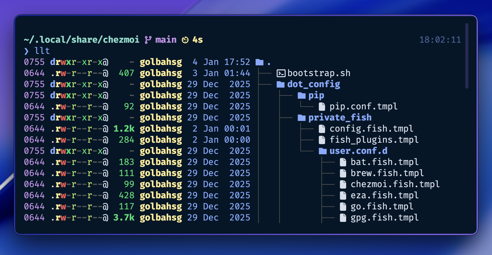

# DakEnviy's Dotfiles


**More than just dotfiles.** An intelligent framework that detects your environment, installs selected apps, and configures them dynamically.

[Demo](https://youtu.be/h2QWn8uz6uU) • [Features](#-features) • [Installation](#-installation) • [Template](https://github.com/DakEnviy/dots-template)

<p align="center"></p>

## ⚡ Why this framework?

Most dotfiles are static: they copy files and hope you have the right apps installed.
**DakEnviy/dots** is different. It acts as an **Infrastructure-as-Code** layer for your workstation. Instead of blindly copying files, it **scans your environment**, installs missing tools, and generates configurations dynamically — minimizing errors and keeping your system consistent across machines.

> **Powered by [chezmoi](https://chezmoi.io/) ❤️** — Leverages its templating engine and state management. See [docs](https://chezmoi.io/) for details.

## ✨ Features

- **🚀 Smart Bootstrap**: Automatically installs `chezmoi`, clones the repo, and re-initializes to configure newly installed packages.
- **🔍 Intelligent Scanning**: Checks your system for installed binaries. If a tool isn't found, its config is skipped — preventing broken paths and configuration errors.
- **🤖 Interactive Setup**: A smart prompt system lets you choose what to install and configure. It remembers your choices and only prompts again when the available tool list changes or detected binaries change.
- **📦 Multi-Manager Support**: Unifies package installation across `apt`, `brew`, `cargo`, and custom scripts. Also supports external binaries via `chezmoi` externals.
- **🔄 Idempotent Design**: All scripts are safe to run multiple times. Plugin managers only update when their config files actually change (using content hashing).
- **🖥️ Context Awareness**: Distinguishes between `desktop` and `server` environments to apply relevant logic (e.g., GPG setup only on desktop).
- **🔐 Secret Management**: Integrates with Bitwarden to fetch GPG keys and auto-configures Git commit signing. On servers, it can fetch and populate SSH `authorized_keys` from a URL.
- **🔌 Plugin Automation**: Automatically manages plugins for Fish (`fisher`), Tmux (`tpm`), and Vim (`vim-plug`).

> 📚 See [CONFIGS.md](CONFIGS.md) for detailed documentation of each configuration.

## 🛠 Installation

To bootstrap a fresh system, simply run:

```bash
sh -c "$(curl -fsLS dots.dakenviy.tech)"
```

And answer the prompts to install the needed tools and configs for them.

> **🏗️ Want to build your own?** Use the [clean template](https://github.com/DakEnviy/dots-template) to create your intelligent dotfiles system.

## 🚀 Usage

```bash
chezmoi init   # Initialize and configure
chezmoi apply  # Apply configurations
```

> 💡 **Tip**: Run `chezmoi diff` before `apply` to preview changes. All operations are idempotent — `apply` is safe to run multiple times.

**Reconfiguration**: The setup remembers your choices and won't prompt again unless binaries or available tools change. To manually adjust your selection:

```bash
chezmoi init --prompt  # Re-run interactive setup
chezmoi apply          # Apply new choices
```

**Syncing changes**: Use standard git commands in the source directory (`~/.local/share/chezmoi`) to commit, push, and pull your changes.

